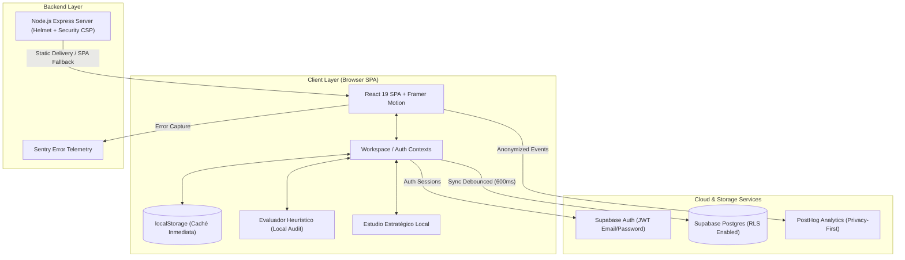

# 🚀 Lean Canvas Pro  
*Plataforma de Alto Rendimiento para Modelado Estratégico de Negocios, Evaluación Heurística Local y Colaboración en Tiempo Real para Startups*

[](https://github.com/markusx5622/Lean-Canvas-Pro)
[](https://www.typescriptlang.org/)
[](https://react.dev/)
[](https://tailwindcss.com/)
[](https://supabase.com/)
[](https://github.com/markusx5622/Lean-Canvas-Pro)
[](file:///c:/Users/es00700248/Desktop/Personal/Lean-Canvas-Pro/LICENSE)

---

## 📌 Índice de Contenidos

1. [Sobre el Proyecto](#-sobre-el-proyecto)
2. [Arquitectura General del Sistema](#-arquitectura-general-del-sistema)
3. [Características Principales](#-características-principales)
4. [Motor Heurístico Local & Asistente Estratégico](#-motor-heur%C3%ADstico-local--asistente-estrat%C3%A9gico)
5. [Catálogo de Plantillas Predefinidas](#-cat%C3%A1logo-de-plantillas-predefinidas)
6. [Persistencia y Sincronización Híbrida (Local-First + Cloud)](#-persistencia-y-sincronizaci%C3%B3n-h%C3%ADbrida-local-first--cloud)
7. [Módulo de Colaboración, Workspaces y Feedback](#-m%C3%B3dulo-de-colaboraci%C3%B3n-workspaces-y-feedback)
8. [Exportación Avanzada y Modo Presentación](#-exportaci%C3%B3n-avanzada-y-modo-presentaci%C3%B3n)
9. [Esquema de Base de Datos y Migraciones SQL](#-esquema-de-base-de-datos-y-migraciones-sql)
10. [Observabilidad y Telemetría (Sentry & PostHog)](#-observabilidad-y-telemetr%C3%ADa-sentry--posthog)
11. [Guía de Instalación y Despliegue Local](#-gu%C3%ADa-de-instalaci%C3%B3n-y-despliegue-local)
12. [Variables de Entorno](#-variables-de-entorno)
13. [Suite de Tests y Control de Calidad](#-suite-de-tests-y-control-de-calidad)
14. [Créditos y Contexto Académico](#-cr%C3%A9ditos-y-contexto-acad%C3%A9mico)
15. [Licencia y Propiedad Intelectual](#-licencia-y-propiedad-intelectual)

---

## 🎯 Sobre el Proyecto

**Lean Canvas Pro** es una plataforma web *Full-Stack* de grado profesional creada para actuar como el sistema operativo decisional de cualquier Startup en fase temprana (*Early Stage*). Diseñada desde la perspectiva de la *Ingeniería de Organización Industrial*, permite a founders, directivos, consultores e inversores conceptualizar, validar e iterar modelos de negocio basados en la metodología *Lean Canvas* de Ash Maurya.

A diferencia de las herramientas genéricas de diagramación, **Lean Canvas Pro** incorpora un **Motor de Evaluación Heurística Local** que inspecciona la especificidad, coherencia lógica cruzada entre bloques, defendibilidad ante inversores y claridad estratégica de cada modelo directamente en el navegador, **garantizando la máxima privacidad sin enviar secretos de negocio a servidores o APIs de terceros**.

---

## 🏗️ Arquitectura General del Sistema

El proyecto combina un frontend interactivo SPA en **React 19** y **TypeScript**, empaquetado con **Vite**, junto a un backend robusto en **Node.js Express** optimizado para entornos servidor y servido híbrido (local y Vercel Serverless).



---

## ✨ Características Principales

### 📋 1. Edición Dinámica del Lienzo de 9 Bloques
- Interfaz interactiva de los 9 bloques del *Lean Canvas*: **Problema, Solución, Propuesta Única de Valor, Ventaja Injusta, Segmentos de Clientes, Canales, Flujo de Ingresos, Estructura de Costes y Métricas Clave**.
- Edición fluida con debounce optimizado, autoguardado multitabla y estado visual de sincronización.
- Soporte para **Modo Claro (Light) y Modo Oscuro (Dark)** pulido al detalle para prevenir fatiga visual en sesiones intensas de brainstorming.

### 🤖 2. Auditoría Heurística de Negocio (100% Local)
- Análisis multivariable en tiempo real del grado de especificidad, claridad y completitud de cada bloque.
- Evaluación de **Coherencia Cruzada** entre bloques (ej. validación del encaje entre Problema y Solución, o compatibilidad entre Canales y Segmentos).
- Generación instantánea de **Alertas para Inversores (*Investor Flags*)**, **Barreras de Defendibilidad** y **Prioridades de Acción**.

### 💼 3. Centro de Plantillas por Industria (*Templates Studio*)
- Biblioteca integrada con **9 plantillas preconfiguradas** preparadas para acelerar el diseño de nuevos modelos: SaaS B2B, Marketplace, E-commerce, Producto de IA, Fintech, EdTech, HealthTech, SaaS B2C y PropTech.

### 👥 4. Colaboración y Control de Accesos (Workspaces)
- Creación de espacios de trabajo (*Workspaces*) multi-usuario con roles diferenciados: **Propietario (*Owner*)**, **Editor** y **Lector (*Viewer*)**.
- Sistema de invitaciones por email mediante tokens seguros de un solo uso.
- **Comentarios por Bloque**: Hilos contextuales de retroalimentación directa sobre elementos concretos del lienzo.
- **Snapshots de Versiones**: Captura de estados históricos del canvas para auditar evoluciones y pivots.

### 🔗 5. Enlaces Públicos de Solo Lectura
- Generación de enlaces únicos públicos (`/share/:token`) protegidos por RPC para compartir modelos con mentores o inversores sin requerir registro.

### 📄 6. Exportación Profesional y Presentación
- Rendereado vectorial de documentos **PDF de alta resolución** utilizando `@react-pdf/renderer`.
- Exportación estructurada de **Resumen Ejecutivo**.
- **Modo Presentación Fullscreen**: Vista interactiva en formato diapositivas optimizada para reuniones de pitch.
- Copias de seguridad completas en formato **JSON** con soporte de importación y restauración inmediata.

---

## 🤖 Motor Heurístico Local & Asistente Estratégico

El núcleo analítico de **Lean Canvas Pro** reside en `src/evaluator` y `src/lib/localStrategicTools.ts`. Al funcionar de forma completamente local, no requiere llamadas a APIs de inteligencia artificial ni subscripciones externas, ofreciendo respuestas instantáneas sin latencia.

### Métrica Global de Evaluación (*Readiness Score*)

El motor evalúa el canvas otorgando una puntuación global sobre **100 puntos** desglosada en las siguientes dimensiones:

| Dimensión | Ponderación | Criterios de Evaluación |
|---|:---:|---|
| **Completitud (*Completeness*)** | 30% | Cobertura de los 9 bloques del lienzo y volumen mínimo de información estructurada. |
| **Especificidad (*Specificity*)** | 35% | Presencia de métricas cuantitativas, cifras financieras, tecnologías nombradas, perfiles concretos y canales explícitos (penaliza la ambigüedad). |
| **Coherencia Cruzada (*Coherence*)** | 20% | Alineación estratégica entre pares críticos: *Problema ↔ Solución*, *Canales ↔ Segmentos*, *Ingresos ↔ Costes*. |
| **Defendibilidad (*Defensibility*)** | 15% | Fuerza de la *Ventaja Injusta* (patentes, efectos de red, contratos exclusivos, data flywheels). |

### Generadores Estratégicos Automáticos

A través del panel **AI Content Studio**, el sistema genera artefactos estratégicos listos para producción:
- 📝 **Resumen Ejecutivo:** Síntesis ejecutiva de la startup a partir de la propuesta de valor y los segmentos clave.
- ⚡ **Elevator Pitch:** Discurso de impacto comercial de 30 segundos.
- 🌐 **Copy para Landing Page:** Encabezados, subtítulos y llamados a la acción (CTAs) para páginas de captación.
- 📊 **Estimación de Tamaño de Mercado (TAM / SAM / SOM):** Desglose heurístico del mercado total, direccionable y obtenible.
- 🔄 **Recomendaciones de Pivotaje:** Diagnóstico de riesgos operativos e hipotesis débiles que requieren validación urgente.

---

## 📦 Catálogo de Plantillas Predefinidas

| Emoji | Plantilla | Categoría | Descripción Breve |
|:---:|---|---|---|
| 💼 | **SaaS B2B** | Software | Herramientas de productividad y automatización para empresas. |
| 🛒 | **Marketplace** | Plataforma | Conexión bilateral de oferta y demanda con efectos de red. |
| 🏪 | **E-commerce** | Retail | Tienda online especializada de alto valor percibido y curación. |
| 🤖 | **Producto de IA** | IA | Automatización de flujos complejos mediante modelos de lenguaje/datos. |
| 💳 | **Fintech** | Finanzas | Servicios financieros digitales, pagos, crédito y gestión eficiente. |
| 🎓 | **EdTech** | Educación | Bootcamps, cursos y formación orientada a inserción laboral. |
| 🏥 | **HealthTech** | Salud | Telemedicina, monitoreo continuo y soluciones de bienestar personal. |
| 📱 | **SaaS B2C** | Software | Aplicaciones de consumo individual enfocadas en hábito y retención. |
| 🏠 | **PropTech** | Inmobiliaria | Digitalización de transacciones, gestión y análisis inmobiliario. |

---

## ⚡ Persistencia y Sincronización Híbrida (Local-First + Cloud)

El sistema de datos está construido bajo la arquitectura **Local-First with Cloud Auto-Sync**:

```
[Entrada de Datos del Usuario]
       │
       ├──► localStorage Cache (Escritura Inmediata < 1ms) ──► Render Instantáneo en UI
       │
       └──► Supabase Postgres Sync (Debounce de 600ms) ─────► Persistencia Segura Multi-Dispositivo
```

### Principales Beneficios:
1. **Zero-Latency UI:** La interfaz responde instantáneamente sin esperar respuesta de red.
2. **Resiliencia Offline:** El usuario puede trabajar sin conexión a Internet; la caché local mantiene los datos intactos.
3. **Migración Transparente:** Los usuarios que inician sesión por primera vez migran automáticamente sus lienzos locales previos a su cuenta en la nube sin pérdida de información.

---

## 👥 Módulo de Colaboración, Workspaces y Feedback

 Lean Canvas Pro soporta la gestión colaborativa a nivel de equipo:

- **Estructura jerárquica:** `Workspace ──► Members & Roles ──► Canvases`.
- **Niveles de Permiso Granulares:**
  - `owner`: Control total del workspace, gestión de miembros, eliminación de lienzos.
  - `editor`: Creación y modificación libre de lienzos e hipótesis dentro del workspace.
  - `viewer`: Acceso exclusivo de lectura y comentarios.
- **Sistema de Comentarios (`canvas_comments`):** Hilos de discusión asociados a cada bloque numerado del 1 al 9, permitiendo iteraciones con timestamp y estado de resolución.

---

## 📊 Exportación Avanzada y Modo Presentación

1. **PDF Vectorial (`CanvasPdfDocument.tsx`):**
   - Layout en apaisado (Landscape A4) fiel al diseño original.
   - Tipografías legibles, codificación de colores por bloque y membrete profesional con metadatos del proyecto.
2. **Presentación Interactiva (`PresentationMode.tsx`):**
   - Modo pantalla completa con soporte de navegación por teclado (flechas / espacio).
   - Diapositivas individuales animadas por bloque con diseño tipográfico de alta legibilidad para proyectores o compartición por videollamada.

---

## 🗄️ Esquema de Base de Datos y Migraciones SQL

La persistencia en la nube utiliza **Supabase Postgres** con **Row Level Security (RLS)** activado en todas las tablas para garantizar aislamiento estricto de inquilinos (*Tenant Isolation*).

### Resumen de Migraciones SQL (`supabase/migrations/`)

| Migración | Nombre | Descripción y Responsabilidad |
|:---:|---|---|
| `001` | `001_create_canvases.sql` | Tabla principal de lienzos (`canvases`), trigger de `updated_at` y políticas RLS para propietarios. |
| `002` | `002_create_canvas_snapshots.sql` | Historial de versiones (`canvas_snapshots`) para respaldar recuperaciones de lienzo. |
| `003` | `003_create_canvas_shares.sql` | Enlaces públicos de solo lectura (`canvas_shares`) y función segura RPC `get_canvas_by_share_token`. |
| `004` | `004_create_workspaces.sql` | Gestión de organizaciones (`workspaces`) y miembros de equipo (`workspace_members`). |
| `005` | `005_create_workspace_invitations.sql` | Gestión de invitaciones pendientes (`workspace_invitations`) y funciones RPC asociadas. |
| `006` | `006_workspace_canvas_permissions.sql` | Ajuste de restricciones de borrado (`DELETE`) según el rol asignado en el workspace. |
| `007` | `007_create_canvas_comments.sql` | Hilos de comentarios por bloque (`canvas_comments`) con políticas de visibilidad por miembros. |
| `008` | `008_workspace_share_read_policy.sql` | Políticas de lectura pública ampliadas para miembros de workspace. |

---

## 🔬 Observabilidad y Telemetría (Sentry & PostHog)

### Sentry Error Tracking (`src/lib/sentry.ts` & `server.ts`)
- **Frontend:** Captura de excepciones no controladas y errores de renderizado mediante `ErrorBoundary`.
- **Backend:** Middleware de captura de errores Express con filtrado de PII (los datos estratégicos de los lienzos nunca se envían a Sentry).
- **Activación transparente:** Se habilita automáticamente solo cuando la variable `VITE_SENTRY_DSN` o `SENTRY_DSN` está presente.

### PostHog Product Analytics (`src/lib/analytics.ts`)
- Métrica anónima del uso de características (creación de lienzos, ejecuciones del evaluador, exportaciones en PDF).
- Sin seguimiento de datos sensibles de negocio ni textos de los bloques.

---

## 🛠️ Guía de Instalación y Despliegue Local

### Requisitos Previos
- **Node.js**: v18.0.0 o superior.
- **npm**: v9.0.0 o superior.
- Proyecto en **Supabase** (cuenta gratuita).

### Pasos de Instalación

1. **Clonar el repositorio:**
   ```bash
   git clone https://github.com/markusx5622/Lean-Canvas-Pro.git
   cd Lean-Canvas-Pro
   ```

2. **Instalar dependencias:**
   ```bash
   npm install
   ```

3. **Configurar el archivo de entorno `.env`:**
   Crea un archivo `.env` en la raíz del proyecto basándote en `.env.example`:
   ```env
   VITE_SUPABASE_URL=https://tu-proyecto.supabase.co
   VITE_SUPABASE_ANON_KEY=tu-clave-anonima-publica
   VITE_SENTRY_DSN=
   SENTRY_DSN=
   PORT=3000
   ```

4. **Ejecutar las migraciones en Supabase:**
   Abre el Editor SQL de tu panel de Supabase y ejecuta en orden secuencial los archivos situados en `supabase/migrations/001_...` a `008_...`.

5. **Iniciar el servidor de desarrollo:**
   ```bash
   npm run dev
   ```
   La aplicación estará disponible en `http://localhost:3000`.

---

## 🔑 Variables de Entorno

| Variable | Ámbito | Requerida | Descripción |
|---|:---:|:---:|---|
| `VITE_SUPABASE_URL` | Frontend | **Sí** | URL Endpoint del proyecto Supabase. |
| `VITE_SUPABASE_ANON_KEY` | Frontend | **Sí** | Clave pública anónima (*Anon Public Key*) de Supabase. |
| `VITE_SENTRY_DSN` | Frontend | No | DSN de Sentry para reporte de errores en cliente. |
| `SENTRY_DSN` | Backend | No | DSN de Sentry para el servidor Express. |
| `VITE_POSTHOG_KEY` | Frontend | No | API Key de PostHog para métricas de uso. |
| `VITE_POSTHOG_HOST` | Frontend | No | Host custom o por defecto de PostHog. |
| `PORT` | Backend | No | Puerto de escucha del servidor HTTP (por defecto `3000`). |

---

## 🧪 Suite de Tests y Control de Calidad

El proyecto cuenta con una cobertura exhaustiva de pruebas unitarias, de integración y pruebas E2E (*End-to-End*).

```bash
# Ejecutar comprobación de tipos TypeScript
npm run lint

# Ejecutar suite de pruebas unitarias (Vitest)
npm run test

# Modo de pruebas interactivas en vivo
npm run test:watch

# Ejecutar pruebas End-to-End con Playwright
npm run test:e2e

# Interfaz visual de Playwright
npm run test:e2e:ui
```

### Cobertura Principal de Tests:
- **`evaluateCanvas.test.ts`**: Pruebas de cálculo de puntuaciones, reglas de coherencia cruzada y priorización de problemas.
- **`evaluateBlock.test.ts`**: Pruebas de especificidad y análisis de términos vagos por bloque.
- **`scoring.test.ts`**: Pruebas de agregación de sub-puntuaciones matemáticas.
- **`localStrategicTools.test.ts`**: Pruebas deterministas de los generadores estratégicos.

---

## 🎓 Créditos y Contexto Académico

**Lean Canvas Pro** ha sido conceptualizado, diseñado y desarrollado íntegramente por **Marc Cubero Cantavella**, en el marco de sus investigaciones y aplicación técnica desde la **Ingeniería de Organización Industrial** en la **Universidad Europea de Valencia**.

- 👨‍💻 **Autor:** Marc Cubero Cantavella
- 🏛️ **Institución:** Universidad Europea de Valencia
- 🔗 **Perfil Profesional:** [LinkedIn - Marc Cubero Cantavella](https://www.linkedin.com/in/marc-cubero-cantavella-bb04542a7)

---

## ⚖️ Licencia y Propiedad Intelectual

**© 2026 Marc Cubero Cantavella. Todos los derechos reservados.**

Esta plataforma, su código fuente, arquitectura, diseño y concepto son propiedad exclusiva e intelectual de su creador.

- 🔹 **Uso Permitido:** Puedes acceder, navegar y utilizar la aplicación funcional desplegada libremente para conceptualizar tus propios modelos de negocio y startups.
- ❌ **Restricciones:** No está permitida la copia, clonación, distribución, redistribución, modificación, reventa o creación de obras derivadas del código fuente o de la interfaz sin la autorización expresa y por escrito de Marc Cubero Cantavella.

> *La presencia de este código fuente en un repositorio público de GitHub cumple una función estrictamente demostrativa y de portafolio profesional de capacidad técnica. No otorga licencias Open Source de libre explotación.* Para más información legal, consulta el archivo [LICENSE](file:///c:/Users/es00700248/Desktop/Personal/Lean-Canvas-Pro/LICENSE).
